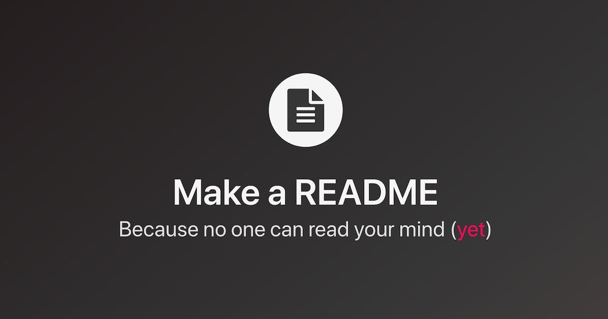

<p align="center">
  <a href="https://devfel.com/" rel="noopener">
 </a>
</p>

<h1 align="center">GitHub Readme Template</h1>
<h3 align="center"> 🔗 Try it live at: https://github.com/devfel/github-readme-template </h3>

<div align="center">

[]()
[](/LICENSE)

</div>

---

<p align="center"> 
This is a GitHub README Template, use at your will. 
Text Example:
In this <b>responsive</b> project using HTML, CSS and JavaScript application I created a ...</p>
<p align="center"> I recomend creating a gif out of screenshots of your work at: https://ezgif.com/maker</p>
  <p align="center">
  <a href="" rel="noopener">
 </a>
</p>

---

## 📝 Table of Contents

- [Test Here](#live)
- [Application Features](#features)
- [Getting Started](#getting_started)
- [Dependencies](#dependencies)
- [Built Using](#built_using)
- [Acknowledgements](#acknowledgements)
- [Liceses](#licenses)
- [Authors](#authors)

---

## 🕹 Test Here <a name = "live"></a>

https://github.com/devfel/github-readme-template

---

## 🧐 Application Features <a name = "features"></a>

Text Example:

- **_List all the Colors and Threads:_** Button to list the complete table with all the colors and floss codes.
- **_Search by color name:_** Option to look for a thread by its color name. It is possible, for example, to search for a color and find all its shades
- **_Search by brand's code:_** If you select a brand and insert a code number for that brand the system will filter and show all the correspodent code for the other thread brands that matchs that color.

With this application the user is able to:<br/>

1. navigate between two pages using react's single page concept <br/>
1. list the total balance inside the cards <br/>
1. list the transactions <br/>
1. upload a file

---

## 🏁 Getting Started <a name = "getting_started"></a>

Text Example:
Because this was done using only HTML, CSS and JavaScript it can be replicated easily within your own browser without much trouble, just clone the project and you can run it with in your browser.

You can clone the repository through Command Prompt or Terminal just by typing:

```sh
git clone https://github.com/devfel/convertfloss.git
```

or download the zip from the green **"Code"** button.

Install dependencies packages with yarn

```sh
yarn
```

---

## 🔁 Dependencies <a name = "dependencies"></a>

Text Example:
Some project library dependencies includes but are not limited to:

- "axios": "^0.19.2",
- "filesize": "^6.1.0",
- "history": "^4.10.1",
- "polished": "^3.5.2",
- "react": "^16.13.1",
- "styled-components": "^5.1.0",
- "typescript": "~3.7.2"
- "cors": "^2.8.5",
- "csv-parse": "^4.8.8",
- "dotenv": "^8.2.0",
- "express": "^4.17.1",
- "express-async-errors": "^3.1.1",
- "multer": "^1.4.2",
- "pg": "^8.3.0",
- "reflect-metadata": "^0.1.13",
- "typeorm": "^0.2.24"
- "typescript": "~3.7.2"

---

## ⛏️ Built Using <a name = "built_using"></a>

Text Example:

- [ReactJS](https://reactjs.org/) - Web Framework
- [JavaScript](https://www.javascript.com/) - Programming Language
- [Typescript](https://www.typescriptlang.org/) - Programming Language
- [HTML](https://pt.wikipedia.org/wiki/HTML) - Markup Language
- [CSS](https://en.wikipedia.org/wiki/CSS) - Style Sheets
- [JSON](https://www.json.org/json-en.html) - Object Notation
- [PostgreSQL](https://www.postgresql.org/) - Database
- [Express](https://expressjs.com/) - Server Framework
- [NodeJs](https://nodejs.org/en/) - Server Environment
- [Insomnia](https://insomnia.rest/) - Rest Client
- [DBeaver](https://dbeaver.io/) - DB administration tool
- [Docker](https://www.docker.com/) - Docker Container

---

## 🎉 Acknowledgements <a name = "acknowledgements"></a>

Text Example:

- JSON file created based on [DevFel](https://devfel.com/) chart.

---

## 📝 Liceses <a name = "licenses"></a>

- Distributed under the MIT License - see the [LICENSE.md](https://github.com/devfel/github-readme-template/blob/master/LICENSE.md) file for details.

---

## ✍️ Author <a name = "authors"></a>

- [@devfel](https://devfel.com/) - Luiz Flávio Felizardo
